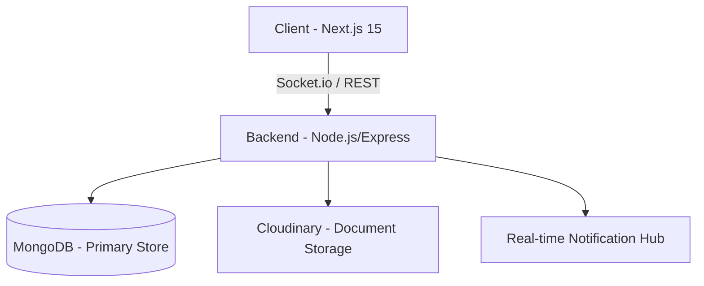

# RemoteFlex 🚀
### High-Performance Remote Job Platform & Career Intelligence System

[](https://github.com/tendocalvin1/RemoteFlex/actions/workflows/ci.yml)
[](https://opensource.org/licenses/ISC)

RemoteFlex is a world-class remote job platform engineered for software developers and technology professionals. It provides a seamless interface for discovering high-quality remote opportunities, managing applications, and facilitating real-time communication.

---

## 🌟 Key Features

- **Advanced Search**: MongoDB Text Search with relevance scoring.
- **Employer ATS**: Comprehensive dashboard for posting and managing job applicants.
- **Job Seeker Dashboard**: Real-time tracking of application statuses.
- **Instant Notifications**: Powered by Socket.io for live feedback loops.
- **Secure Auth**: JWT authentication using HTTP-only cookies and CSRF protection.
- **Modern UI**: Built with Next.js 15, Tailwind CSS, and TanStack Query.

---

## 🏗️ Architecture Overview



Detailed technical documentation can be found in [RemoteFlex_Documentation.md](./RemoteFlex_Documentation.md).

---

## 🛠️ Technology Stack

| Layer | Technologies |
|---|---|
| **Frontend** | Next.js 15 (App Router), React 19, Tailwind CSS, TanStack Query, Zustand |
| **Backend** | Node.js, Express.js, Socket.io, Mongoose |
| **Database** | MongoDB Atlas |
| **Storage** | Cloudinary |
| **DevOps** | Docker, GitHub Actions (CI) |

---

## 🚀 Getting Started

### Prerequisites

- Node.js 20+
- Docker & Docker Compose
- MongoDB Atlas Account
- Cloudinary Account

### Installation

1. **Clone the repository:**
   ```bash
   git clone https://github.com/tendocalvin1/RemoteFlex.git
   cd RemoteFlex
   ```

2. **Setup Backend:**
   ```bash
   cd job-portal-backend
   cp .env.example .env
   # Configure your environment variables
   npm install
   ```

3. **Setup Frontend:**
   ```bash
   cd ../job-portal-frontend
   cp .env.example .env.local
   # Configure your environment variables
   npm install
   ```

### Running Locally

**Using Docker (Recommended):**
```bash
docker-compose up --build
```

**Manual Start:**
- Backend: `npm run dev` (Port 8000)
- Frontend: `npm run dev` (Port 3000)

---

## 🧪 Testing

```bash
cd job-portal-backend
npm test
```

---

## 📡 API Documentation

Interactive Swagger UI is available at:
`http://localhost:8000/api-docs`

---

## 🤝 Contributing

We welcome contributions! Please see our [Technical Debt & Recommendations](./RemoteFlex_Documentation.md#26-technical-debt-and-recommendations) section for areas where you can help.

---

## 📄 License

This project is licensed under the ISC License.

---

## 👤 Author

**Tendo Calvin**
- GitHub: [@tendocalvin1](https://github.com/tendocalvin1)
- Role: Senior Full-stack Engineer

---
*Built with ❤️ for the global remote workforce.*
