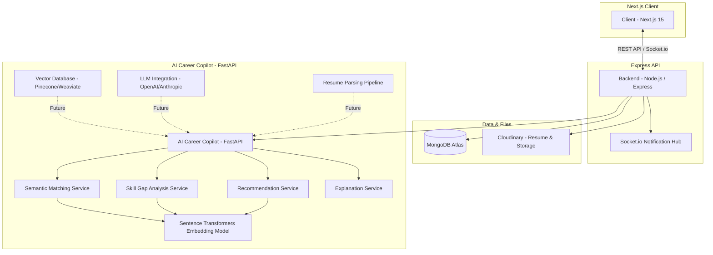

# RemoteFlex
---

RemoteFlex is a high-performance remote job platform and AI-powered career intelligence system engineered to connect employers and job seekers in the remote-first technology landscape. Built with a focus on security, real-time engagement, and high-performance search, it provides a seamless end-to-end experience from job discovery to application management. 
In addition to job discovery, applicant tracking, secure authentication, and real-time notifications, RemoteFlex includes an AI Career Copilot built with Python and FastAPI that performs semantic resume-to-job matching, skill gap analysis, explainable recommendations, and personalized career guidance.
---

## 🌟 Key Features

### Core Platform Features
- **Advanced Search**: MongoDB Text Search with relevance scoring.
- **Employer ATS**: Comprehensive dashboard for posting and managing applicants.
- **Job Seeker Dashboard**: Real-time tracking of application statuses.
- **Instant Notifications**: Powered by Socket.io for live feedback loops.
- **Secure Authentication**: JWT authentication using HTTP-only cookies and CSRF protection.
- **Modern UI**: Built with Next.js 15, Tailwind CSS, TanStack Query, and Zustand.

### AI Career Copilot Features
- **Semantic Resume Matching**: Uses transformer embeddings to compare resumes with job descriptions.
- **Skill Gap Analysis**: Detects missing skills required for target roles.
- **Explainable AI Matching**: Generates human-readable explanations for every match score.
- **Career Recommendations**: Suggests actionable steps to improve employability.
- **REST API with Swagger**: Fully documented FastAPI endpoints for AI services.
- **Automated Testing**: Pytest-based integration tests for all AI endpoints.
---

## 🏗️ Architecture Overview

The following diagram reflects the current system architecture and the integrated AI Career Copilot roadmap.




---

## 🛠️ Technology Stack

| Layer | Technologies |
|------|------|
| **Frontend** | Next.js 15 (App Router), React 19, Tailwind CSS, TanStack Query, Zustand |
| **Backend** | Node.js, Express.js, Socket.io, Mongoose |
| **AI Services** | Python, FastAPI, Sentence Transformers, Scikit-learn, Pytest |
| **Database** | MongoDB Atlas |
| **Storage** | Cloudinary |
| **DevOps** | Docker, GitHub Actions (CI) |
---

## 🤖 AI Career Copilot Architecture

The AI Career Copilot is a dedicated FastAPI service that analyzes resumes and job descriptions using transformer embeddings and semantic similarity.

Implemented services include:

- Embedding Service
- Matching Service
- Explanation Service
- Skill Gap Analysis Service
- Recommendation Service

The system returns ranked job matches, missing skills, and actionable recommendations to help candidates improve their fit for target roles.

## 🚀 Getting Started

### Prerequisites
- Node.js 20+
- MongoDB Atlas cluster
- Cloudinary account
- SMTP server for emails (e.g., Gmail App Password)

### Installation

1. **Clone the repository:**
   ```bash
   git clone https://github.com/tendocalvin1/RemoteFlex.git
   cd RemoteFlex
   ```

2. **Setup Backend:**
   ```bash
   cd job-portal-backend
   npm install
   cp .env.example .env # Configure your MongoDB, JWT, and Cloudinary keys
   ```

3. **Setup Frontend:**
   ```bash
   cd ../job-portal-frontend
   npm install
   cp .env.example .env.local # Configure NEXT_PUBLIC_API_URL
   ```

### Running Locally

**Start Backend (Dev Mode):**
```bash
cd job-portal-backend
npm run dev
```

**Start Frontend:**
```bash
cd job-portal-frontend
npm run dev
```

---

## 🧪 Testing

The backend includes a suite of unit and integration tests using the native Node.js test runner.

## 🧪 Testing

### Backend Tests
```bash
cd job-portal-backend
npm test

cd career-copilot
pytest -v

---

### API Documentation


### Platform API (Node.js / Express)
Interactive Swagger UI:
http://localhost:8000/api-docs

### AI Career Copilot API (FastAPI)
Interactive Swagger UI:
http://localhost:8000/docs
---

## 📁 Project Structure

RemoteFlex/
├── job-portal-backend/
│   ├── config/              # Database, Socket, Email, and Logger configurations
│   ├── controllers/         # Business logic for users, jobs, and applications
│   ├── middleware/          # Authentication, CSRF, and sanitization logic
│   ├── models/              # Mongoose schemas for User, Job, and Application
│   ├── routes/              # Express API endpoints
│   ├── test/                # Unit and integration test suites
│   └── app.js               # Express application setup
│
├── job-portal-frontend/
│   ├── src/app/             # Next.js App Router (pages and layouts)
│   ├── src/components/      # Reusable UI components and skeletons
│   ├── src/hooks/           # Custom hooks for auth and notifications
│   ├── src/lib/             # Axios instance and CSRF setup
│   └── src/store/           # Zustand state management
│
├── ai-services/
│   └── career-copilot/
│       ├── app/
│       │   ├── routers/     # FastAPI route handlers
│       │   ├── services/    # Embedding, matching, skill gap, and recommendation services
│       │   ├── config.py    # Application configuration
│       │   ├── schemas.py   # Pydantic request and response models
│       │   └── main.py      # FastAPI application entry point
│       ├── tests/           # Pytest integration tests
│       ├── requirements.txt # Python dependencies
│       └── pytest.ini       # Test configuration
│
├── .github/workflows/       # GitHub Actions CI pipeline
├── docker-compose.yml       # Local development orchestration
└── README.md
```

---

## 📄 License

This project is licensed under the ISC License.

---

## 👤 Author

**Tendo Calvin**
Senior Full-stack Engineer
[GitHub: @tendocalvin1](https://github.com/tendocalvin1)
