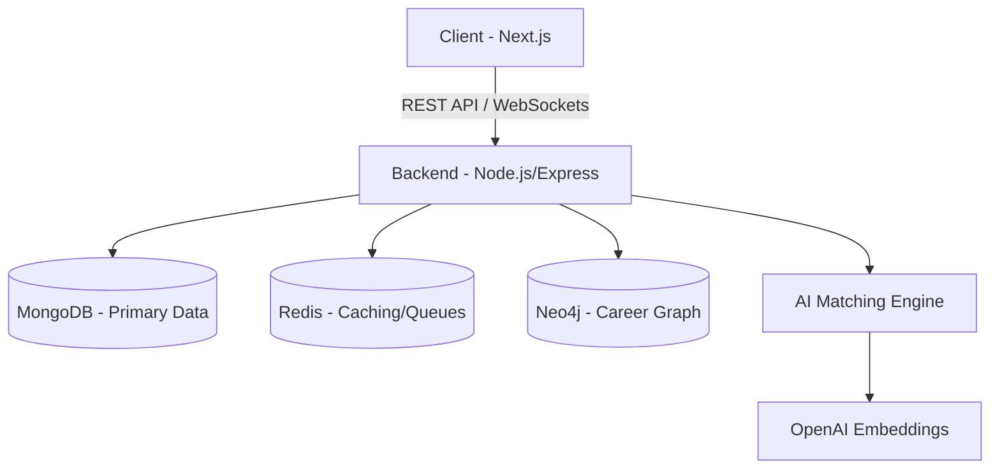

# RemoteFlex 🚀
### AI-Powered Remote Job Platform & Career Intelligence System

[](https://github.com/tendocalvin1/RemoteFlex/actions/workflows/ci.yml)
[](https://opensource.org/licenses/ISC)

RemoteFlex is a world-class remote job platform designed for software engineers and technology professionals. It leverages AI and semantic search to bridge the gap between global talent and remote opportunities.

---

## 🌟 Key Features

- **AI Career Copilot:** Match resumes to jobs with semantic intelligence.
- **Dynamic Job Feed:** Advanced filtering by salary, category, and remote type.
- **Employer Dashboard:** Complete ATS for managing job postings and applicants.
- **Real-time Notifications:** Instant updates via Socket.io.
- **Secure Auth:** Multi-layered JWT authentication with HTTP-only cookies.
- **Responsive UI:** Modern, high-performance interface built with Next.js 15 & Tailwind CSS.

---

## 🏗️ Architecture



Detailed technical documentation can be found in [RemoteFlex_Documentation.md](./RemoteFlex_Documentation.md).

---

## 🛠️ Technology Stack

| Layer | Technologies |
|---|---|
| **Frontend** | Next.js 15, React 19, Tailwind CSS, TanStack Query, Zustand |
| **Backend** | Node.js, Express.js, Socket.io, Mongoose |
| **Database** | MongoDB Atlas, Neo4j, Redis |
| **DevOps** | Docker, GitHub Actions, AWS (EKS, S3, CloudFront) |
| **AI/ML** | OpenAI, Semantic Search, Vector Embeddings |

---

## 🚀 Getting Started

### Prerequisites

- Node.js 20+
- Docker & Docker Compose
- MongoDB Atlas Account
- Cloudinary Account

### Installation

1. **Clone the repository:**
   ```bash
   git clone https://github.com/tendocalvin1/RemoteFlex.git
   cd RemoteFlex
   ```

2. **Setup Backend:**
   ```bash
   cd job-portal-backend
   cp .env.example .env
   # Fill in your environment variables
   npm install
   ```

3. **Setup Frontend:**
   ```bash
   cd ../job-portal-frontend
   cp .env.example .env.local
   # Fill in your environment variables
   npm install
   ```

### Running Locally

**Using Docker (Recommended):**
```bash
docker-compose up --build
```

**Manual Start:**
- Backend: `npm run dev` (in `job-portal-backend`)
- Frontend: `npm run dev` (in `job-portal-frontend`)

---

## 🧪 Running Tests

```bash
cd job-portal-backend
npm test
```

---

## 📡 API Documentation

Access the interactive Swagger UI at:
`http://localhost:8000/api-docs`

---

## 🤝 Contributing

We welcome contributions! Please see our [Contribution Guide](./RemoteFlex_Documentation.md#39-open-source-contribution-guide) for details.

---

## 📄 License

This project is licensed under the ISC License.

---

## 👤 Author

**Tendo Calvin**
- GitHub: [@tendocalvin1](https://github.com/tendocalvin1)
- Role: Senior Full-stack Engineer

---
*Built with ❤️ for the global remote workforce.*
