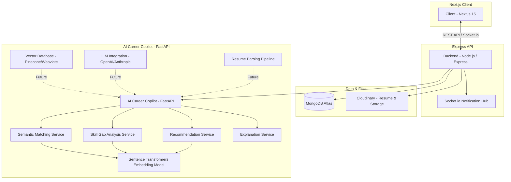

# RemoteFlex

RemoteFlex is a robust job portal platform designed to connect employers and job seekers in the remote-first technology landscape. Built with a focus on security, real-time engagement, and high-performance search, it provides a seamless end-to-end experience from job discovery to application management.

---

## 🌟 Key Features

### For Job Seekers
- **AI-Powered Discovery**: Leverage semantic matching and skill gap analysis to find the best-fit roles.
- **Unified Dashboard**: Track application statuses (Pending, Reviewed, Shortlisted, Rejected) in real-time.
- **Secure Document Management**: Upload resumes and cover letters via Cloudinary integration.
- **Career Intelligence**: Instant notifications for status updates and personalized career recommendations.

### For Employers
- **Intelligent ATS**: Full Applicant Tracking System with semantic candidate ranking.
- **AI Career Copilot**: Automated matching of candidates to job requirements using sentence embeddings.
- **Real-Time Candidate Alerts**: Instant notifications via Socket.io when new high-match candidates apply.
- **Detailed Analytics**: Track job views, application counts, and candidate quality scores.

---

## 🏗️ Architecture Overview

The following diagram reflects the current system architecture and the integrated AI Career Copilot roadmap.



> **Note:** Components marked as *Future* are currently in the integration pipeline.

---

## 🛠️ Technology Stack

| Layer | Technologies |
|---|---|
| **Frontend** | Next.js 15, React 19, Tailwind CSS, TanStack Query v5, Zustand v5 |
| **Backend** | Node.js, Express 5, Socket.io, Mongoose 9, Winston |
| **Database** | MongoDB Atlas |
| **Storage** | Cloudinary (Resume & Logo storage) |
| **Security** | JWT (Access/Refresh tokens in HTTP-only cookies), CSRF Protection, Helmet |
| **Testing** | Node.js Test Runner, Supertest, MongoDB Memory Server |

---

## 🚀 Getting Started

### Prerequisites
- Node.js 20+
- MongoDB Atlas cluster
- Cloudinary account
- SMTP server for emails (e.g., Gmail App Password)

### Installation

1. **Clone the repository:**
   ```bash
   git clone https://github.com/tendocalvin1/RemoteFlex.git
   cd RemoteFlex
   ```

2. **Setup Backend:**
   ```bash
   cd job-portal-backend
   npm install
   cp .env.example .env # Configure your MongoDB, JWT, and Cloudinary keys
   ```

3. **Setup Frontend:**
   ```bash
   cd ../job-portal-frontend
   npm install
   cp .env.example .env.local # Configure NEXT_PUBLIC_API_URL
   ```

### Running Locally

**Start Backend (Dev Mode):**
```bash
cd job-portal-backend
npm run dev
```

**Start Frontend:**
```bash
cd job-portal-frontend
npm run dev
```

---

## 🧪 Testing

The backend includes a suite of unit and integration tests using the native Node.js test runner.

```bash
cd job-portal-backend
npm test
```

---

## 📡 API Documentation

RemoteFlex provides interactive API documentation via Swagger UI. Once the backend is running, access it at:
`http://localhost:8000/api-docs`

---

## 📁 Project Structure

```text
RemoteFlex/
├── job-portal-backend/
│   ├── config/          # DB, Socket, Email, and Logger configurations
│   ├── controllers/     # Business logic for users, jobs, and applications
│   ├── middleware/      # Auth, CSRF, and Sanitization logic
│   ├── models/          # Mongoose schemas for User, Job, and Application
│   ├── routes/          # Express API endpoints
│   ├── test/            # Unit and Integration test suites
│   └── app.js           # Express application setup
├── job-portal-frontend/
│   ├── src/app/         # Next.js App Router (Pages & Layouts)
│   ├── src/components/  # UI components and skeletons
│   ├── src/hooks/       # Custom hooks for auth and notifications
│   ├── src/lib/         # Axios instance and CSRF setup
│   └── src/store/       # Zustand auth state
└── .github/workflows/   # CI/CD pipeline (CI tests & linting)
```

---

## 📄 License

This project is licensed under the ISC License.

---

## 👤 Author

**Tendo Calvin**
Senior Full-stack Engineer
[GitHub: @tendocalvin1](https://github.com/tendocalvin1)
