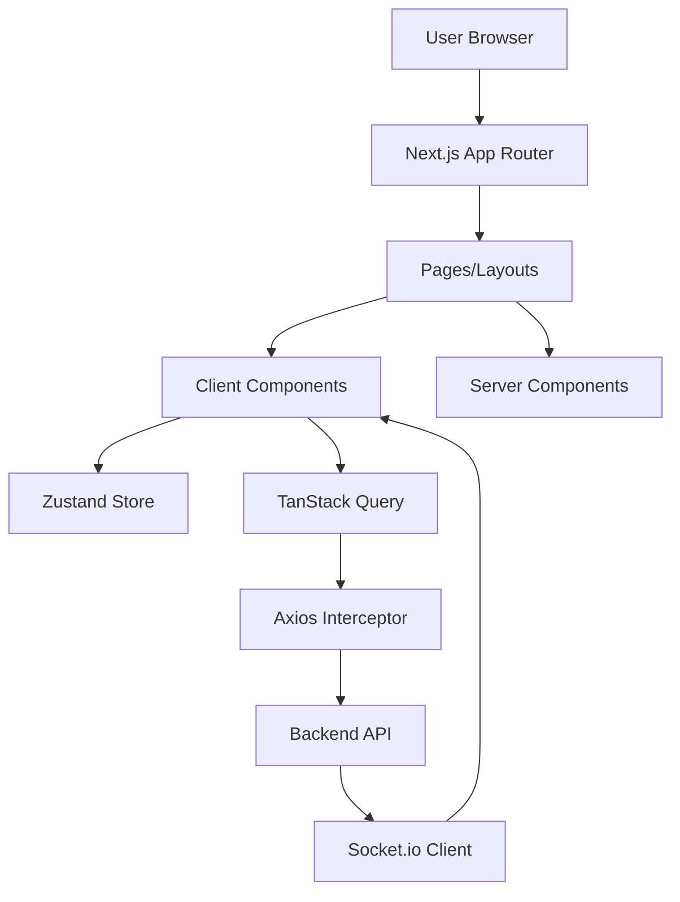
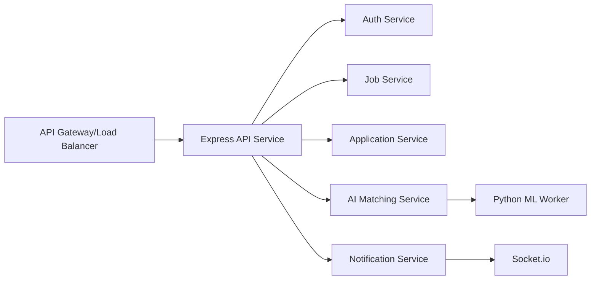
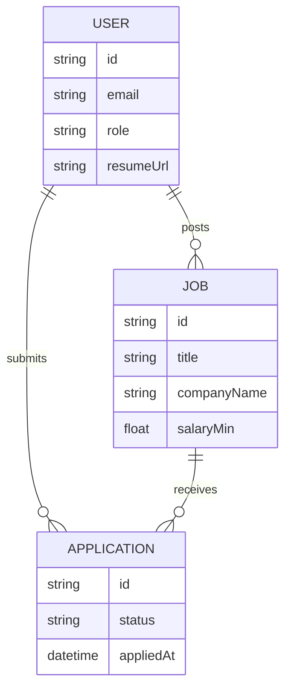
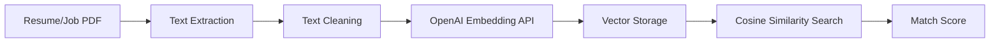
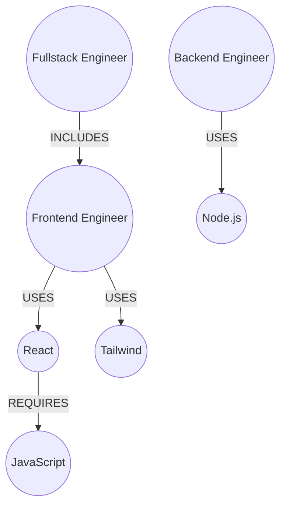
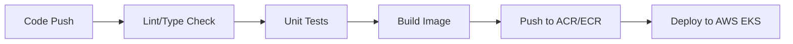
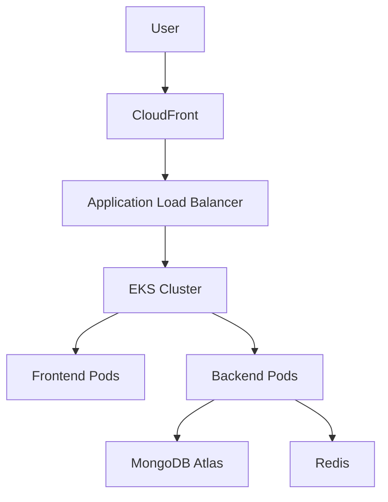
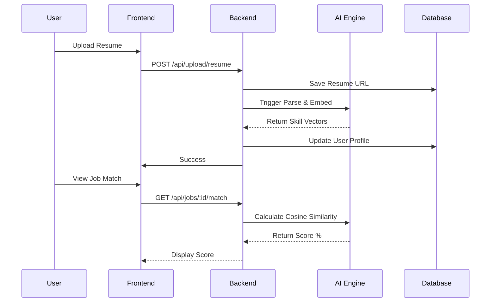

# RemoteFlex Technical Documentation
## World-Class Engineering Blueprint & Architectural Guide

**Project Repository:** [RemoteFlex](https://github.com/tendocalvin1/RemoteFlex)  
**Version:** 1.0.0 (MVP)  
**Date:** May 11, 2026  
**Status:** Active Development / Architecture Blueprint

---

## Table of Contents
1. [Executive Summary](#1-executive-summary)
2. [Product Vision](#2-product-vision)
3. [Business Problem and Solution](#3-business-problem-and-solution)
4. [Core Features](#4-core-features)
5. [Technology Stack](#5-technology-stack)
6. [Monorepo Structure](#6-monorepo-structure)
7. [Frontend Architecture](#7-frontend-architecture)
8. [Backend Architecture](#8-backend-architecture)
9. [API Design](#9-api-design)
10. [Authentication and Authorization](#10-authentication-and-authorization)
11. [Database Design](#11-database-design)
12. [Prisma Schema Overview](#12-prisma-schema-overview)
13. [Redis and Caching Strategy](#13-redis-and-caching-strategy)
14. [Background Job Processing with BullMQ](#14-background-job-processing-with-bullmq)
15. [AI/ML Architecture](#15-ai-ml-architecture)
16. [Resume Parsing Pipeline](#16-resume-parsing-pipeline)
17. [Semantic Matching Engine](#17-semantic-matching-engine)
18. [Skill Gap Analysis Engine](#18-skill-gap-analysis-engine)
19. [Career Readiness Scoring](#19-career-readiness-scoring)
20. [Learning Roadmap Generator](#20-learning-roadmap-generator)
21. [Neo4j Knowledge Graph Architecture](#21-neo4j-knowledge-graph-architecture)
22. [File Upload and Storage](#22-file-upload-and-storage)
23. [Security Architecture](#23-security-architecture)
24. [Performance Optimization](#24-performance-optimization)
25. [Error Handling Strategy](#25-error-handling-strategy)
26. [Logging and Monitoring](#26-logging-and-monitoring)
27. [Testing Strategy](#27-testing-strategy)
28. [Docker Architecture](#28-docker-architecture)
29. [CI/CD Pipeline Architecture](#29-ci-cd-pipeline-architecture)
30. [Deployment Architecture](#30-deployment-architecture)
31. [AWS Infrastructure Overview](#31-aws-infrastructure-overview)
32. [Environment Variables Reference](#32-environment-variables-reference)
33. [Data Flow Diagrams](#33-data-flow-diagrams)
34. [Sequence Diagrams](#34-sequence-diagrams)
35. [Scalability Strategy](#35-scalability-strategy)
36. [Cost Optimization Strategy](#36-cost-optimization-strategy)
37. [Roadmap and Future Enhancements](#37-roadmap-and-future-enhancements)
38. [Portfolio and Resume Value](#38-portfolio-and-resume-value)
39. [Open Source Contribution Guide](#39-open-source-contribution-guide)
40. [Conclusion](#40-conclusion)

---

## 1. Executive Summary
RemoteFlex is a high-performance, AI-powered remote job platform specifically engineered for the modern technology workforce. By leveraging semantic search, machine learning, and career intelligence, RemoteFlex transcends traditional job boards to provide a comprehensive career growth ecosystem.

## 2. Product Vision
To become the definitive intelligence layer for remote technology careers, bridging the gap between global opportunities and talent through data-driven matching and personalized growth paths.

## 3. Business Problem and Solution
**Problem:** Traditional job boards suffer from poor matching quality, overwhelming noise for employers, and a lack of actionable career guidance for candidates.
**Solution:** RemoteFlex implements an AI-driven "Career Copilot" that analyzes resumes against job requirements in real-time, providing candidates with skill gap analysis and employers with ranked, high-compatibility applicants.

## 4. Core Features
- **AI Matching:** Semantic analysis of resumes against job descriptions.
- **Career Intelligence:** Readiness scoring and skill gap identification.
- **Real-time Notifications:** Socket.io powered application updates.
- **Employer Suite:** Complete applicant tracking system (ATS) with status management.
- **Advanced Filtering:** Multi-dimensional job search (salary, remote type, category).

## 5. Technology Stack
- **Frontend:** Next.js 15 (App Router), Tailwind CSS, TanStack Query, Zustand.
- **Backend:** Node.js, Express.js, Socket.io.
- **Database:** MongoDB (Mongoose), Neo4j (Knowledge Graph).
- **Caching/Queues:** Redis, BullMQ.
- **Auth:** Custom JWT with HTTP-only Cookies & CSRF protection.
- **Infrastructure:** Docker, GitHub Actions, AWS (EKS, S3, CloudFront).
- **AI/ML:** OpenAI Embeddings, Python-based Microservices (Planned).

## 6. Monorepo Structure
```text
RemoteFlex/
├── job-portal-backend/    # Node.js Express API
├── job-portal-frontend/   # Next.js Application
├── .github/workflows/     # CI/CD Pipelines
└── docker-compose.yml     # Local Orchestration
```

## 7. Frontend Architecture
Built on **Next.js 15**, the frontend utilizes a component-driven architecture with atomic design principles.
- **State Management:** Zustand for lightweight auth and UI state.
- **Data Fetching:** TanStack Query for server state synchronization and caching.
- **Styling:** Tailwind CSS with a custom design system.
- **Real-time:** Socket.io client for live updates.

### Mermaid: Frontend Architecture


## 8. Backend Architecture
A modular Express.js architecture following the **Controller-Service-Repository** pattern.
- **Controllers:** Handle HTTP requests and response formatting.
- **Middleware:** Auth, Validation, Sanitization, CSRF.
- **Models:** Mongoose schemas for data persistence.
- **Services:** (In Progress) Business logic isolation for AI and matching.

### Mermaid: Backend Microservices Architecture


## 9. API Design
RESTful API with JSON payloads, versioned under `/api/v1`.
- **Security:** CSRF tokens, Rate Limiting, Helmet headers.
- **Documentation:** Integrated Swagger/OpenAPI UI at `/api-docs`.

## 10. Authentication and Authorization
Multi-layered security using:
1. **Access Tokens:** Short-lived JWTs in HTTP-only cookies.
2. **Refresh Tokens:** Long-lived JWTs stored in MongoDB + HTTP-only cookies.
3. **CSRF Protection:** Synchronizer Token Pattern.
4. **RBAC:** Middleware-enforced roles (`job_seeker`, `employer`).

## 11. Database Design
- **Primary (Document):** MongoDB for users, jobs, and applications.
- **Secondary (Graph):** Neo4j for mapping skills to career paths and learning roadmaps.

### Mermaid: Database Relationships


## 12. Prisma Schema Overview
*Note: While currently using Mongoose for MongoDB, the architecture plan includes migrating to Prisma for type-safe database access and Postgres support for relational career data.*

## 13. Redis and Caching Strategy
Redis is utilized for:
- **Session Caching:** Storing active user sessions.
- **Job Feed Caching:** Reducing DB load for high-traffic search queries.
- **Rate Limit Tracking:** Distributed rate limiting across API instances.

## 14. Background Job Processing with BullMQ
Asynchronous processing for:
- **Resume Parsing:** Extracting text and skills from PDFs/Docs.
- **Email Dispatch:** Sending application updates and verification emails.
- **AI Scoring:** Running heavy matching algorithms off the main thread.

## 15. AI/ML Architecture
The AI engine uses **OpenAI's `text-embedding-3-small`** model to convert resumes and job descriptions into vector embeddings, enabling semantic matching beyond simple keyword searches.

### Mermaid: AI/ML Processing Pipeline


## 16. Resume Parsing Pipeline
1. Upload to **Cloudinary**.
2. Trigger BullMQ job.
3. Extract text using `pdf-parse`.
4. Structure data with GPT-4o-mini into standardized JSON (skills, experience, education).

## 17. Semantic Matching Engine
Calculates a "Match Score" based on:
- Vector similarity of skills and experience.
- Salary range compatibility.
- Location/Remote preference alignment.

## 18. Skill Gap Analysis Engine
Identifies missing keywords and concepts by comparing candidate profiles against high-ranking job requirements in the same category.

## 19. Career Readiness Scoring
A proprietary algorithm (0-100) that weights:
- Profile completeness.
- Skill match for target roles.
- Activity level on the platform.

## 20. Learning Roadmap Generator
Generates a step-by-step path to acquire missing skills, linking to curated resources (e.g., Coursera, Udemy) via the Neo4j Knowledge Graph.

## 21. Neo4j Knowledge Graph Architecture
Maps the relationship between `Skill -> Role -> Industry`. 
Example: `(React)-[:REQUIRED_FOR]->(Frontend Engineer)-[:PART_OF]->(Web Development)`.

### Mermaid: Neo4j Knowledge Graph


## 22. File Upload and Storage
- **Cloudinary:** Primary storage for resumes and company logos.
- **S3 (Future):** Planned for large-scale document archiving.

## 23. Security Architecture
- **JWT + Cookies:** Mitigates XSS.
- **CSRF Tokens:** Mitigates Cross-Site Request Forgery.
- **Rate Limiting:** Prevents Brute Force/DDoS.
- **Input Sanitization:** Prevents NoSQL Injection and XSS.

## 24. Performance Optimization
- **Next.js Image Optimization:** Automatic resizing/compression.
- **Database Indexing:** Optimized indexes on `status`, `category`, and `employer_id`.
- **Query Pagination:** Enforced on all list endpoints.

## 25. Error Handling Strategy
Standardized error responses with appropriate HTTP status codes and structured error messages for frontend consumption.

## 26. Logging and Monitoring
- **Winston/Morgan:** Structured logging in the backend.
- **Sentry (Planned):** For frontend/backend error tracking.
- **Prometheus/Grafana (Planned):** For infrastructure monitoring.

## 27. Testing Strategy
- **Unit Tests:** Jest for utility functions and hooks.
- **Integration Tests:** Supertest for API endpoints.
- **E2E Tests (Planned):** Playwright for critical user flows (Login -> Apply).

## 28. Docker Architecture
Containerized environment for consistent deployment.
- **Backend:** `node:20-alpine` based Dockerfile.
- **Frontend:** Multi-stage build for production Next.js.

## 29. CI/CD Pipeline Architecture
Automated workflows via GitHub Actions.

### Mermaid: CI/CD Pipeline


## 30. Deployment Architecture
Deployed on **AWS** using a modern containerized approach.

## 31. AWS Infrastructure Overview
- **Compute:** EKS (Elastic Kubernetes Service).
- **Database:** MongoDB Atlas (SaaS).
- **Networking:** Route53, ALB, CloudFront.

### Mermaid: AWS Deployment Architecture


## 32. Environment Variables Reference
Key variables required for system operation (refer to `.env.example`).

## 33. Data Flow Diagrams
**User Application Flow:**
`User -> Frontend -> Backend API -> Validation -> DB Write -> Socket Notification -> Employer Dashboard`.

## 34. Sequence Diagrams
### Mermaid: Resume-to-Job Matching Flow


## 35. Scalability Strategy
- **Horizontal Scaling:** EKS auto-scaling for pod replicas.
- **Read Replicas:** MongoDB secondary nodes for search queries.

## 36. Cost Optimization Strategy
- **Spot Instances:** For non-critical EKS workloads.
- **S3 Lifecycle Policies:** Moving old resumes to Glacier.

## 37. Roadmap and Future Enhancements
- [ ] Implement Neo4j Knowledge Graph for skills mapping.
- [ ] Integrate BullMQ for asynchronous resume parsing.
- [ ] Migrate to Prisma + Postgres for relational data consistency.
- [ ] Add AI Career Copilot Chatbot (GPT-4o integration).
- [ ] Develop Mobile App using React Native.
- [ ] Implement Advanced Analytics for employers (applicant trends).

## 38. Technical Debt and Improvements (Task 7)
### Identified Architectural Inconsistencies
1. **Database Schema:** Currently uses Mongoose. For a complex career graph, a transition to Prisma + Postgres (relational) alongside Neo4j (graph) is recommended.
2. **Monorepo Management:** The project structure is a basic split-folder. Implementing **Turborepo** would significantly improve build times and dependency management.
3. **AI Implementation:** Currently relies on MongoDB text search. Transitioning to a true **Vector Database** (like Pinecone or MongoDB Atlas Vector Search) is critical for semantic matching.

### Refactoring Opportunities
- **Backend Services:** Move business logic from controllers into dedicated service classes.
- **Frontend Components:** Extract reusable UI patterns into a shared `@remoteflex/ui` package.
- **Type Safety:** Migrate the entire backend to **TypeScript** to match modern enterprise standards.

### Security Concerns
- **Email Verification:** Ensure `NODE_ENV === "production"` strictly enforces email verification.
- **Secret Management:** Move from `.env` files to **AWS Secrets Manager** or **HashiCorp Vault** for production.

### Performance Bottlenecks
- **Resume Parsing:** Large PDF parsing is currently synchronous. Moving this to a BullMQ worker is a priority to prevent API timeouts.
- **Image Handling:** Ensure all images are served via a CDN (CloudFront) with appropriate cache headers.

## 39. Portfolio and Resume Value
RemoteFlex demonstrates expertise in:
- **Full-stack System Design**
- **Security-first Engineering**
- **AI Integration**
- **Cloud Native Infrastructure**

## 39. Open Source Contribution Guide
1. Fork the repo.
2. Create a feature branch.
3. Ensure tests pass (`npm test`).
4. Submit a PR with detailed documentation.

## 40. Conclusion
RemoteFlex is more than a job board; it's a technically sophisticated career intelligence platform designed for the future of work.

---
*Generated by RemoteFlex Engineering Team*
