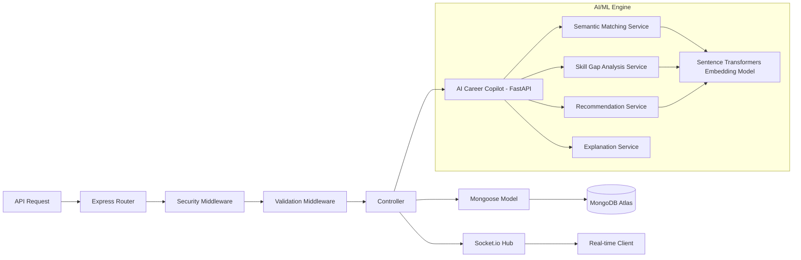

# RemoteFlex Technical Documentation
## Implementation-Based Architectural Guide

**Project Repository:** [RemoteFlex](https://github.com/tendocalvin1/RemoteFlex)  
**Version:** 1.0.0 (MVP)  
**Date:** May 14, 2026  
**Status:** MVP Stable

---

## Table of Contents
1. [System Overview](#1-system-overview)
2. [Core Implementation Features](#2-core-implementation-features)
3. [Technology Stack](#3-technology-stack)
4. [Monorepo Structure](#4-monorepo-structure)
5. [Frontend Architecture](#5-frontend-architecture)
6. [Backend Architecture](#6-backend-architecture)
7. [API Design & Documentation](#7-api-design--documentation)
8. [Authentication & Authorization Flow](#8-authentication--authorization-flow)
9. [Database Schema & Design](#9-database-schema--design)
10. [Job Search Implementation](#10-job-search-implementation)
11. [Real-time Events (Socket.io)](#11-real-time-events-socketio)
12. [File Handling (Multer & Cloudinary)](#12-file-handling-multer--cloudinary)
13. [Security Implementation](#13-security-implementation)
14. [Error Handling & Logging](#14-error-handling--logging)
15. [Testing Strategy](#15-testing-strategy)
16. [Containerization (Docker)](#16-containerization-docker)
17. [CI/CD Workflow](#17-ci-cd-workflow)
18. [Environment Configuration](#18-environment-configuration)
19. [Data Flow & Lifecycle](#19-data-flow--lifecycle)
20. [Technical Debt & Implementation Recommendations](#20-technical-debt--implementation-recommendations)

---

## 1. System Overview
RemoteFlex is a full-stack job board application. It is architected as a decoupled system with a Next.js frontend and an Express.js backend, utilizing MongoDB for persistent storage and Socket.io for real-time notifications between employers and job seekers.

## 2. Core Implementation Features
- **Job Search**: Filtering by category, remote type, and salary range, combined with text-based keyword matching.
- **Application Tracking**: Real-time status updates (Pending, Reviewed, Shortlisted, Rejected).
- **Employer Tools**: Job listing management (Create/Update/Close) and applicant review interface.
- **Document Management**: Direct integration with Cloudinary for resume and document hosting.
- **Notifications**: Instant alerts for new applicants (Employer) and status updates (Job Seeker).

## 3. Technology Stack
- **Frontend**: Next.js 15 (App Router), Tailwind CSS, TanStack Query v5, Zustand v5.
- **Backend**: Node.js, Express 5.2.1, Mongoose 9.3.3, Socket.io 4.8.3.
- **Database**: MongoDB Atlas.
- **Security**: JWT (Access/Refresh), HTTP-only Cookies, CSRF Protection, Helmet, Rate Limiting.
- **Testing**: Node.js native test runner, Supertest.

## 4. Monorepo Structure
```text
RemoteFlex/
├── job-portal-backend/    # Express Server
│   ├── config/            # External service & app config
│   ├── controllers/       # Business logic handlers
│   ├── middleware/        # Auth, Security, Validation
│   ├── models/            # Mongoose Schemas
│   ├── routes/            # Express Routes
│   └── test/              # Integration/Unit Tests
├── job-portal-frontend/   # Next.js Application
│   ├── src/app/           # Routes and Layouts
│   ├── src/components/    # UI Layer
│   ├── src/hooks/         # Business logic & Auth hooks
│   ├── src/lib/           # API clients (Axios)
│   └── src/store/         # Global state (Zustand)
└── .github/workflows/     # CI Configuration
```

## 5. Frontend Architecture
The frontend is built on **Next.js 15** using the App Router.
- **State Management**: **Zustand** is used for auth persistence and session state.
- **Server State**: **TanStack Query** handles all asynchronous data fetching, caching, and optimistic updates.
- **API Communication**: **Axios** instance configured with `withCredentials: true` and interceptors for CSRF token injection.

## 6. Backend Architecture
The backend is a **Stateless Express API**.
- **Security Middleware**: Every request passes through Helmet, Rate Limiter, and Sanitization layers.
- **Auth Middleware**: Validates JWTs from HTTP-only cookies and checks role-based permissions.
- **Socket Hub**: Integrated directly into the server to map `userId` to active `socketId` for targeted events.

### Mermaid: Backend Architecture


## 7. API Design & Documentation
- **REST Principles**: Standardized JSON responses for all endpoints.
- **Swagger/OpenAPI**: Interactive documentation hosted at `/api-docs` using `swagger-jsdoc`.

## 8. Authentication & Authorization Flow
1. **Login**: Backend issues an **Access Token** (short-lived) and a **Refresh Token** (long-lived) via `set-cookie` (HTTP-only, Secure).
2. **Refresh**: Frontend Axios interceptor detects 401 and calls `/api/users/refresh-token` to rotate tokens.
3. **CSRF**: A unique CSRF token is issued on login/refresh, required in the `X-CSRF-Token` header for all state-changing requests.
4. **Roles**: Middleware restricts access to employer-only or job-seeker-only routes.

## 9. Database Schema & Design
- **User Model**: Stores credentials, profile info, and resume metadata.
- **Job Model**: Stores listing details with a **Text Index** on title, description, and tags.
- **Application Model**: Stores the relationship between users and jobs, with a **Unique Compound Index** on `{job, applicant}` to prevent duplicate entries.

## 10. Job Search Implementation
- **Keyword Search**: Uses MongoDB `$text` search with `$meta: "textScore"` for relevance ranking.
- **Filtering**: Combines text search with exact matches on `category`, `remoteType`, and range queries on `salaryMin`/`salaryMax`.

## 11. Real-time Events (Socket.io)
- **job:newApplicant**: Emitted to the employer's socket when a job seeker applies.
- **applicationStatusUpdate**: Emitted to the job seeker's socket when an employer changes an application status.

## 12. File Handling (Multer & Cloudinary)
- **Multer**: Parses multipart form data for file uploads.
- **Cloudinary**: Acts as the document and image repository. The backend stores the `publicId` and `url` returned from Cloudinary.

## 13. Security Implementation
- **HTTP-only Cookies**: Mitigates XSS-based token theft.
- **CSRF Tokens**: Mitigates cross-site request forgery.
- **Rate Limiting**: Enforced on all routes (100 req/15min) with stricter limits on auth (10 req/15min).
- **Input Sanitization**: Uses `sanitize-html` and custom middleware to strip potentially malicious scripts from user input.

## 14. Error Handling & Logging
- **Global Error Handler**: Catches all exceptions, logs them with **Winston**, and returns a sanitized JSON response.
- **Structured Logging**: Winston is configured to log errors with stack traces to the console (and potentially files in production).

## 15. Testing Strategy
- **Node.js Native Test Runner**: Used for all unit and integration tests (`node --test`).
- **Supertest**: Facilitates HTTP-level integration testing.
- **Memory Server**: `mongodb-memory-server` ensures tests run in isolation without side effects on production data.

## 16. Containerization (Docker)
- **Dockerfile**: Multi-stage build for the backend using `node:20-alpine`.
- **Docker Compose**: Defines services for local development orchestration.

## 17. CI/CD Workflow
- **GitHub Actions**: Triggers on push to `main` and pull requests.
- **Steps**:
  - Installs dependencies with `npm ci`.
  - Runs syntax checks (`node --check`).
  - Executes the test suite (`npm test`).
  - Verifies frontend build (`npm run build`).

## 18. Environment Configuration
Required variables for the system to function:
- `MONGODB_URI`: Database connection.
- `JWT_SECRET` / `JWT_REFRESH_SECRET`: Token encryption keys.
- `CLOUDINARY_*`: File storage credentials.
- `EMAIL_*`: SMTP credentials for Nodemailer.

## 19. Data Flow & Lifecycle
1. **Job Creation**: Employer -> API -> Validation -> MongoDB.
2. **Job Application**: Job Seeker -> Upload Resume (Cloudinary) -> API -> MongoDB -> Socket.io (Notification to Employer).
3. **Status Update**: Employer -> API -> MongoDB -> Socket.io (Notification to Job Seeker) -> Email (Nodemailer).

## 20. Technical Debt & Implementation Recommendations
- **TypeScript**: The system is currently JavaScript-based. A migration to TypeScript is recommended for better type safety and developer experience.
- **AI Career Copilot Expansion**:
    - **Vector Search**: Transition to **Vector Databases** (Pinecone/Weaviate) for scalable semantic retrieval.
    - **LLM Integration**: Incorporate **OpenAI/Anthropic** for natural language profile summaries and cover letter generation.
    - **Automated Parsing**: Implement a high-fidelity **Resume Parsing Pipeline** to extract structured data from unstructured documents.
- **Background Jobs**: Currently, email and file processing happen within the request cycle. Moving these to a queue system (like BullMQ/Redis) would improve API response times.

---
*Documentation current as of: May 14, 2026*
