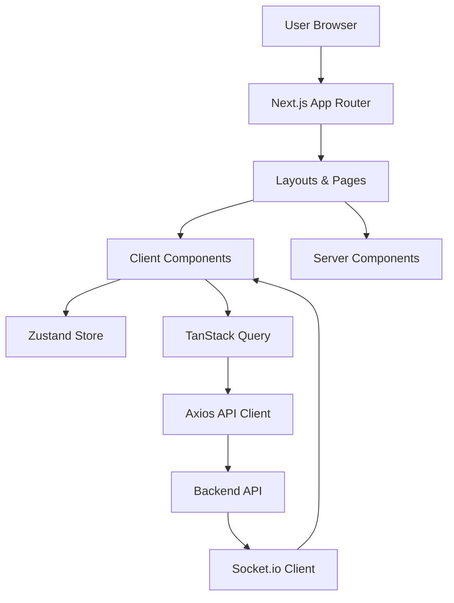
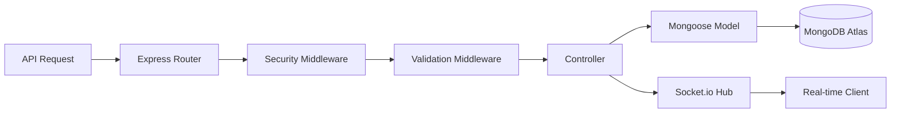
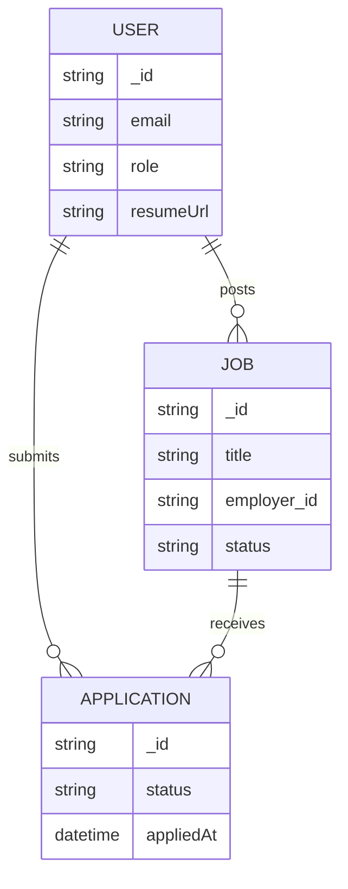
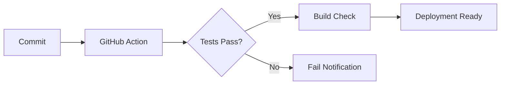
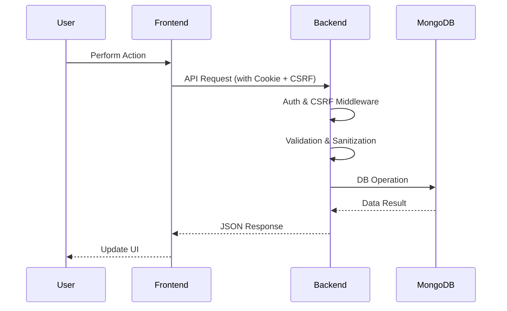

# RemoteFlex Technical Documentation
## World-Class Engineering Blueprint & Architectural Guide

**Project Repository:** [RemoteFlex](https://github.com/tendocalvin1/RemoteFlex)  
**Version:** 1.0.0 (MVP)  
**Date:** May 11, 2026  
**Status:** Stable MVP / Implementation-Based Documentation

---

## Table of Contents
1. [Executive Summary](#1-executive-summary)
2. [Product Vision](#2-product-vision)
3. [Core Features](#3-core-features)
4. [Technology Stack](#4-technology-stack)
5. [Monorepo Structure](#5-monorepo-structure)
6. [Frontend Architecture](#6-frontend-architecture)
7. [Backend Architecture](#7-backend-architecture)
8. [API Design](#8-api-design)
9. [Authentication and Authorization](#9-authentication-and-authorization)
10. [Database Design](#10-database-design)
11. [Search Engine Implementation](#11-search-engine-implementation)
12. [Real-time Communication (Socket.io)](#12-real-time-communication-socketio)
13. [File Upload and Storage](#13-file-upload-and-storage)
14. [Security Architecture](#14-security-architecture)
15. [Performance Optimization](#15-performance-optimization)
16. [Error Handling Strategy](#16-error-handling-strategy)
17. [Logging and Monitoring](#17-logging-and-monitoring)
18. [Testing Strategy](#18-testing-strategy)
19. [Docker Architecture](#19-docker-architecture)
20. [CI/CD Pipeline Architecture](#20-ci-cd-pipeline-architecture)
21. [Environment Variables Reference](#21-environment-variables-reference)
22. [Data Flow Diagrams](#22-data-flow-diagrams)
23. [Sequence Diagrams](#23-sequence-diagrams)
24. [Scalability Strategy](#24-scalability-strategy)
25. [Future Roadmap & Planned Enhancements](#25-future-roadmap--planned-enhancements)
26. [Technical Debt and Recommendations](#26-technical-debt-and-recommendations)
27. [Conclusion](#27-conclusion)

---

## 1. Executive Summary
RemoteFlex is a robust, full-stack remote job platform engineered for software developers and technology professionals. It provides a seamless interface for discovering high-quality remote opportunities, managing applications, and facilitating real-time communication between employers and job seekers.

## 2. Product Vision
To create the most efficient and secure ecosystem for the global remote workforce, starting with a powerful search-centric job portal and evolving into an AI-driven career intelligence platform.

## 3. Core Features
- **Advanced Job Search**: Multi-parameter filtering (category, remote type, salary, location).
- **Keyword Matching**: MongoDB Text Search integration for relevance-based results.
- **Employer ATS**: A complete dashboard for posting jobs and managing applicants.
- **Job Seeker Dashboard**: Track application statuses in real-time.
- **Real-time Notifications**: Instant alerts for application updates and new candidates.
- **Secure Document Handling**: Cloudinary integration for resume and document storage.

## 4. Technology Stack
- **Frontend**: Next.js 15 (App Router), Tailwind CSS, TanStack Query, Zustand.
- **Backend**: Node.js, Express.js, Socket.io, Mongoose.
- **Database**: MongoDB Atlas.
- **Auth**: JWT with HTTP-only Cookies & CSRF protection.
- **Infrastructure**: Docker, GitHub Actions (CI).

## 5. Monorepo Structure
```text
RemoteFlex/
├── job-portal-backend/    # Express.js REST API
│   ├── config/            # Database, Socket, Swagger configs
│   ├── controllers/       # Route handlers
│   ├── middleware/        # Auth, Validation, Sanitization
│   ├── models/            # Mongoose schemas
│   └── routes/            # API endpoints
├── job-portal-frontend/   # Next.js Application
│   ├── src/app/           # App Router pages
│   ├── src/components/    # Reusable UI components
│   ├── src/hooks/         # Custom React hooks
│   └── src/store/         # Zustand state management
└── .github/workflows/     # CI/CD Pipelines
```

## 6. Frontend Architecture
The frontend leverages **Next.js 15** with the App Router for optimal performance and SEO.
- **State Management**: **Zustand** handles authentication and UI state.
- **Data Fetching**: **TanStack Query** manages server state, caching, and background synchronization.
- **Styling**: **Tailwind CSS** provides a responsive, utility-first design system.
- **Client Library**: **Axios** with custom interceptors for CSRF and token refresh.

### Mermaid: Frontend Architecture


## 7. Backend Architecture
The backend follows a **Modular Monolith** pattern with Express.js.
- **Router Layer**: Directs requests to appropriate controllers.
- **Middleware Layer**: Enforces security, validation, and sanitization.
- **Controller Layer**: Orchestrates business logic and database interactions.
- **Model Layer**: Defines data structure using Mongoose schemas.

### Mermaid: Backend Architecture


## 8. API Design
RESTful API implementation with structured JSON responses.
- **Endpoints**: Standardized under `/api/`.
- **Documentation**: Swagger/OpenAPI documentation available at `/api-docs`.
- **Versioning**: Currently in v1 (implicit).

## 9. Authentication and Authorization
A multi-layered security approach:
1. **JWT Strategy**: Access and Refresh tokens.
2. **Storage**: Tokens are stored in **HTTP-only, Secure Cookies** to prevent XSS.
3. **CSRF Protection**: Synchronizer Token Pattern using a custom header (`X-CSRF-Token`).
4. **RBAC**: Middleware-based Role-Based Access Control (`job_seeker`, `employer`).

## 10. Database Design
MongoDB is utilized for its schema flexibility and built-in text search capabilities.
- **Users**: Credentials, profiles, and resume metadata.
- **Jobs**: Posting details, employer references, and status.
- **Applications**: Mappings between users and jobs with status tracking.

### Mermaid: Database Relationships


## 11. Search Engine Implementation
RemoteFlex uses **MongoDB Text Search** for high-performance job discovery.
- **Text Index**: Created on `title`, `description`, `companyName`, and `tags`.
- **Relevance**: Utilizes `$meta: "textScore"` to sort results by keyword density and relevance.
- **Filters**: Compound queries combining text search with salary range, category, and remote type filters.

## 12. Real-time Communication (Socket.io)
Integrated for instant feedback loops:
- **Events**: `job:newApplicant`, `applicationStatusUpdate`.
- **Authentication**: Socket handshake validated using the same JWT cookies as the REST API.
- **Mapping**: Maintains a server-side `Map` of `userId -> socketId` for targeted notifications.

## 13. File Upload and Storage
- **Provider**: **Cloudinary** for image and document storage.
- **Logic**: Multer middleware handles file buffers; controllers upload to Cloudinary and store the returned URLs and public IDs in MongoDB.

## 14. Security Architecture
- **Helmet**: Enforces secure HTTP headers.
- **Rate Limiting**: Protects against brute-force and DoS (100 req/15min globally, 10 req/15min for auth).
- **Sanitization**: `sanitize-html` and custom middleware prevent XSS and NoSQL injection.
- **Payload Limits**: Restricted to 3MB to prevent memory exhaustion.

## 15. Performance Optimization
- **Database Indexing**: Optimized indexes on `status`, `category`, and text fields.
- **Next.js Optimizations**: Automatic image optimization and code splitting.
- **Caching**: TanStack Query manages client-side caching to reduce redundant API calls.

## 16. Error Handling Strategy
- **Global Error Middleware**: Catches all unhandled exceptions and returns standardized JSON.
- **Environment Awareness**: Detailed stack traces in development; sanitized messages in production.

## 17. Logging and Monitoring
- **Winston**: Structured logging for the backend.
- **Morgan**: HTTP request logging with streaming to Winston.

## 18. Testing Strategy
- **Unit Testing**: Node.js built-in test runner for middleware and utility functions.
- **Integration Testing**: Supertest for API endpoint verification.
- **Mocking**: `mongodb-memory-server` for database isolation during tests.

## 19. Docker Architecture
- **Multi-stage Build**: Optimizes image size for the backend.
- **Base Image**: `node:20-alpine`.
- **Orchestration**: `docker-compose.yml` for local development.

## 20. CI/CD Pipeline Architecture
Automated via **GitHub Actions**.
- **Steps**:
  1. **Backend**: Dependency install -> Environment setup -> Syntax check -> Test run.
  2. **Frontend**: Dependency install -> Linting -> Build verification.

### Mermaid: CI/CD Flow


## 21. Environment Variables Reference
Key variables required for deployment:
- `MONGODB_URI`: Database connection string.
- `JWT_SECRET` / `JWT_REFRESH_SECRET`: Encryption keys.
- `CLOUDINARY_*`: Storage credentials.
- `CLIENT_URL`: Frontend origin for CORS.

## 22. Data Flow Diagrams
**Job Application Flow**:
`User submits form -> Frontend sends POST -> Backend validates JWT/CSRF -> Controller uploads to Cloudinary -> Model saves to MongoDB -> Socket emits notification to Employer`.

## 23. Sequence Diagrams
### Mermaid: User Request Lifecycle


## 24. Scalability Strategy
- **Horizontal Scaling**: Stateless backend architecture ready for container orchestration (e.g., K8s).
- **Database**: MongoDB Atlas provides seamless vertical and horizontal scaling (sharding).

## 25. Future Roadmap & Planned Enhancements
The following features are architectural priorities for the next phase of development:
- **AI Career Copilot**: Transition from keyword search to **Vector Search** (OpenAI Embeddings + Pinecone).
- **Skill Gap Analysis**: Automated comparison between resume content and job requirements.
- **Neo4j Knowledge Graph**: Mapping career paths and skill relationships.
- **Background Jobs**: Implementing **BullMQ** and **Redis** for asynchronous resume parsing.
- **Relational Migration**: Integrating **Prisma** for complex relational career data.

## 26. Technical Debt and Recommendations
### Critical Priorities
1. **TypeScript Migration**: The codebase is currently JavaScript. Migrating to TypeScript is essential for enterprise-grade type safety.
2. **Vector Search Integration**: Current "AI Matching" is limited to text search. True semantic matching requires vector embeddings.
3. **CD Implementation**: The current CI pipeline does not include automated deployment or Docker image pushing.

### Architectural Improvements
- **Service Layer**: Extract business logic from controllers into a dedicated service layer for better testability.
- **Centralized Validation**: Consolidate validation logic using a library like Zod or Joi across both frontend and backend.

## 27. Conclusion
RemoteFlex is a technically sound MVP that prioritizes security, real-time engagement, and clean architecture. It provides a solid foundation for the planned AI-driven enhancements that will transform it into a world-class career intelligence system.

---
*Documentation updated: May 11, 2026*  
*Author: Tendo Calvin — RemoteFlex Project Portfolio*
